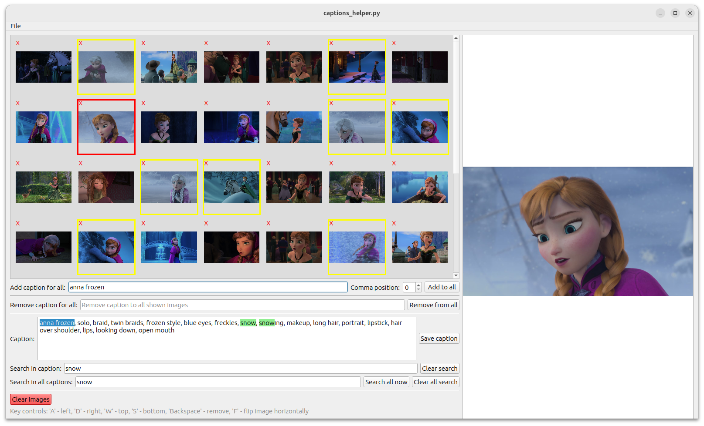
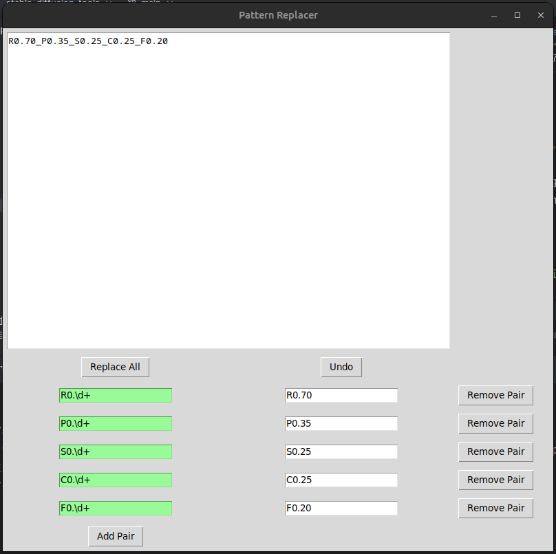
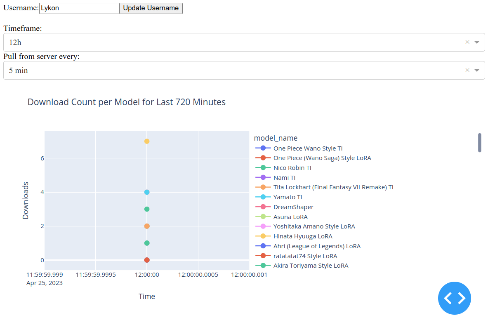

# Setup
## Create requirements:
``` python
pipreqs .
```

## Install  requirements:
``` python
pip install -r requirements.txt
```

# My articles:
* [Can we identify most Stable Diffusion Model issues with just a few circles?](https://www.reddit.com/r/StableDiffusion/comments/12u6c76/can_we_identify_most_stable_diffusion_model/?utm_source=share&utm_medium=web2x&context=3)
* [Stable Diffusion 2.1 - What is a woman? NSFW Models comparison, no. 1.](https://www.reddit.com/r/unstable_diffusion/comments/zg27jv/stable_diffusion_21_what_is_a_woman_nsfw_models/?utm_source=share&utm_medium=web2x&context=3)
* [Stable Diffusion 2.1 - What is a woman? NSFW Models comparison, no. 2.](https://www.reddit.com/r/unstable_diffusion/comments/zg73ba/stable_diffusion_21_what_is_a_woman_nsfw_models/?utm_source=share&utm_medium=web2x&context=3)
* [Stable Diffusion 2.1 - What is a woman? NSFW Models comparison, no. 3.](https://www.reddit.com/r/unstable_diffusion/comments/zg8cd7/stable_diffusion_21_what_is_a_woman_nsfw_models/?utm_source=share&utm_medium=web2x&context=3)
* [Stable Diffusion 2.1 - What is a woman? NSFW Models comparison, no. 4.](https://www.reddit.com/r/unstable_diffusion/comments/zg971f/stable_diffusion_21_what_is_a_woman_nsfw_models/?utm_source=share&utm_medium=web2x&context=3)
* [SD 2.1 Hands - are they better?](https://www.reddit.com/r/StableDiffusion/comments/zfel6y/sd_21_hands_are_they_better/?utm_source=share&utm_medium=web2x&context=3)
* [Only Hands, comparison of 23 models](https://www.reddit.com/r/StableDiffusion/comments/ze2ooc/stable_hands_hands_comparison_in_23_models/?utm_source=share&utm_medium=web2x&context=3)
* [Only Hands, comparison of 23 models, no. 2](https://www.reddit.com/r/StableDiffusion/comments/zez6y3/only_hands_comparison_of_23_models_no_2/?utm_source=share&utm_medium=web2x&context=3)
* [What is your favorite model?](https://www.reddit.com/r/StableDiffusion/comments/za1bj2/what_is_your_favorite_model/?utm_source=share&utm_medium=web2x&context=3)

# My Stable Diffusion Models:
* [Babes](https://civitai.com/models/2220/babes)
* [Babes Kissable Lips
](https://civitai.com/models/26566/babes-kissable-lips)
* [Sexy Toons feat. Pipa](https://civitai.com/models/35549/sexy-toons-feat-pipa)

# Scripts:

##  [Caption Helper:](captions_helper.py)
### Features:
1. Visual preview of images.
2. Show caption file content for each image.
3. Edit caption text.
4. Add new text after specific comma to all files.


## [Pattern Replacer](pattern_replacer.py)
### Features:
1. Replace multiple patterns at text.
2. Add/remove couples of regex and replacement string.
3. Save/load automatically the state to file.


## [Civitai Dashboard](civitai_dashboard.py)
### Warning:
* The script not fully debugged. It needs further work. 
### Features:
1. Pull models of user with Civitai API.
2. Plot all models on graph with corresponding downloads per model.
3. Data pulled periodically and saved to local database.


## [File Downloader](file_downloader.py)
### Features:
1. Download files from a list of URLs.

## [Files split to directories](files_split_to_directories.py)
### Features:
1.  files in a directory by their creation date.

## [Images auto crop](images_auto_crop.py)
### Features:
1.  Crop images by size from each side by pixels.

## [Images auto crop percent](images_auto_crop_percent.py)
### Features:
1.  Crop images from each side by percentage

## [Images downsize and filter small](images_downsize_and_filter_small.py)
### Features:
1.  Resize images in a directory.
2.  Delete images smaller than certain size.

## [Images find bad exif](images_find_bad_exif.py)
### Features:
1.  Check exif data can be read.
2.  Allow to remove exif from images with problematic exif.

## [Images flip horizontal](images_flip_horizontal.py)
### Features:
1.  Flip images horizontally.
2.  Option to flip randomly with 50% chance.

## [Images rename](images_rename.py)
### Features:
1.  Rename files in folder, use a pattern.

## [Images sort by ratio](images_sort_by_ratio.py)
### TODO:
1. Need a way to concentrate images with similar aspect ratio to common folders.
### Features:
1. Images sort into folders by aspect ratio of the image.

## [Civitai Download](civitai_download.py)
### TODO:
1. Download by model URL or model name.
### Features:
1. Download model from Civitai using list and configuration in the file: [download_config.json](download_config.json).
2. Can download multiple models at same time.

## [Exif Extract](exif_script.py)
### TODO:
1. Fix export to file wrong encoding.
### Features:
1. Print Exif info to screen.